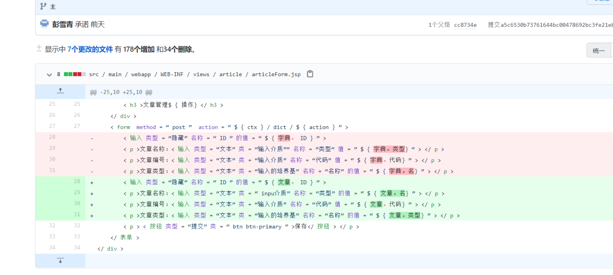
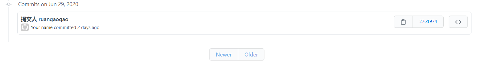
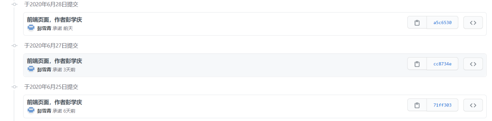
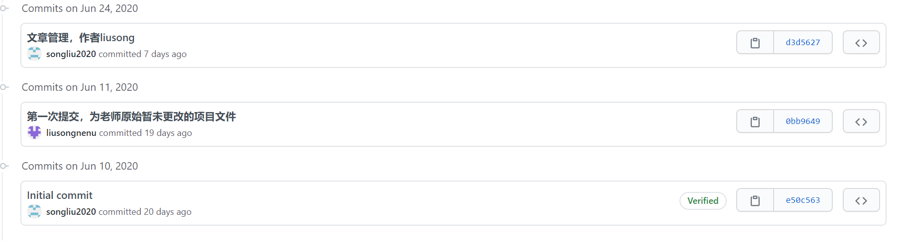

# 一体化三期末大作业 #
小组组长：刘松  组员 ：王俊逸  阮杲杲 彭学庆 
分工 文章管理：刘松   用户管理,数据字典 ：王俊逸  栏目管理：阮杲杲  前端页面以及jsp操作：彭学庆
整合 ：王俊逸

说明：老师，由于我们对于您的作业提交要求理解的不是很得当，再原本的旧仓库中由于添加文件失当失当使得项目结构杂乱并且内容耦合，所以我们另外建立了一个新的库来储存原来整合之后的项目，因此只能将整合后的整体上传，在此感到非常抱歉，我们标明了各个人所处理的项目部分，并且附上了提交的日志截图，请老师能够原谅我们由于github使用不当给您带来的麻烦，祝您假期愉快。
项目提交日志：

注（由于网络原因，图片可能无法显示，下载项目后可以查看）

作者liusong
文章管理
在老师项目基础上的添加及修改：
添加了
文章类Dictionarya.java
文章接口DictionaryRepositorya.java
文章服务层DictionaryaService.java
文章控制层DictionaryaController.java
前端添加了文件夹dicta
文件夹下有三个文件
detail.jsp
form.jsp
list.jsp
同时修改了两个文件
修改了nav.tag中的“文章管理”所指向的路径，由artile改为dicta
修改了application.properties中的数据库密码

旧仓库地址：https://github.com/songliu2020/yth3work.git

作者：彭学庆
所有前端页面以及jsp脚本

旧仓库地址：https://github.com/songliu2020/yth3work.git
在旧仓库提交日志
重建的新项目地址https://github.com/pengxueqing/-3-.git

作者 阮杲杲：
在老师项目基础上的添加及修改：
添加了
栏目接口CategoryRepositorya.java
服务层层CategoryService.java
控制层CategoryController.java

仓库地址： https://github.com/ruangg096/ssh1homework

作者 王俊逸 
用户登录、CURD 
在老师的框架下写了用户的登陆，用户的增删改查 
改了 UserController 
改了 UserRepository 
改了 login.jsp 
新仓库地址：https://github.com/choa000/ythwork3.git

